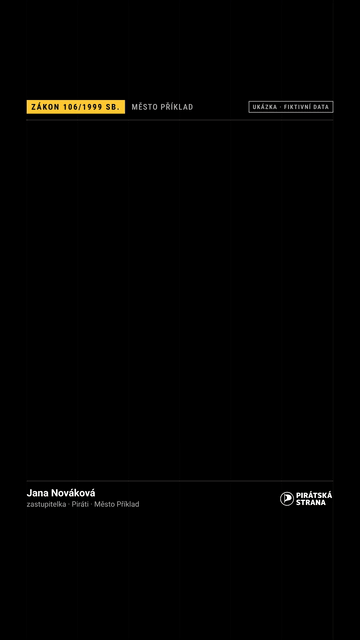

# Piráti KB – znalostní báze České pirátské strany jako MCP server

Jeden zdroj pravdy o Pirátské straně, ke kterému se každý pirát připojí ze své AI
(Claude, ChatGPT, Cursor…) pomocí Model Context Protocol (MCP). Najdete v něm:

- lidi a organizační strukturu,
- program a stanoviska,
- tiskové zprávy a články,
- hlasování v Poslanecké sněmovně, Senátu, Evropském parlamentu a Zastupitelstvu hl. m. Prahy,
- návrhy zákonů a interpelace pirátských poslanců,
- působení Pirátů ve vládě Petra Fialy (2021–2024) a usnesení Zastupitelstva a Rady hl. m. Prahy,
- výsledky voleb a zvolení Piráti (ČSÚ),
- financování strany (výroční zprávy, kampaně, transparentní účty),
- průvodce žádostí podle zákona 106 a dotazem zastupitele (lhůty, šablony, grafika a video),
- příspěvky politiků na sítích a přepisy videí,
- weby krajských a místních sdružení,
- brand a šablony,
- rozcestník pirátských systémů, aby člen věděl, kam s problémem,
- skladebné nástroje: profil politika a obce, časová osa tématu, novinky, ověření tvrzení
  a kontrola textu před zveřejněním.

Stav: **běžící prototyp**. Server je veřejně nasazený na Vercelu a data se obnovují
automaticky každý den. Kurátorovaná vrstva (`content/`) je založená, zatím obsahuje
jen návrhy. Architektura a plán jsou v [docs/navrh-architektury.md](docs/navrh-architektury.md).

## Připojení (hostovaný server na Vercelu)

```
https://piratekb-veritasderman-3065s-projects.vercel.app/mcp
```

- **claude.ai, Claude Desktop, mobilní Claude:** Settings → Connectors → *Add custom
  connector* → vložit adresu výše. Veřejný konektor je bez přihlášení a vrací jen veřejná
  data. Členská data (viditelnost: clenske) vidí jen ověření členové na instanci
  s přihlášením přes auth.pirati.cz, viz [docs/auth-keycloak.md](docs/auth-keycloak.md).
- **Claude Code:**
  `claude mcp add --transport http piratekb https://piratekb-veritasderman-3065s-projects.vercel.app/mcp`
- **ChatGPT a další klienti s podporou MCP přes HTTP:** stejná adresa.
- **Kontrola, že server běží:** `…vercel.app/health`.

Podrobný návod, včetně lokálního běhu přes Docker, je v
[docs/pripojeni/README.md](docs/pripojeni/README.md).

## Vzorové prompty

Stačí AI napsat, co potřebujete, pro koho to je a v jaké formě; nástroje báze si vybere sama
a u tvrzení uvede zdroj. Celý přehled podle účelu je v [docs/prompty.md](docs/prompty.md)
(server ho nabízí i jako resource `kb://navod/prompty`). Například:

> Jaký je oficiální postoj Pirátů k dostupnému bydlení? Odliš, co je v programu, co
> v tiskových zprávách a co jsou jen vyjádření jednotlivých politiků.

> Jaké návrhy zákonů předložil Jakub Michálek a které z nich prošly?

> Kdo jsou pirátští zastupitelé v Liberci a za jaké volby byli zvoleni?

> Žádost jsem poslal dnes datovou schránkou. Zapiš mi lhůty do kalendáře a připrav
> příspěvek „podali jsme žádost“ a scénář krátkého videa.

## Ukázky: grafika a video k žádostem podle 106



Ukázky jsou na fiktivních datech a vznikly ze šablon v repozitáři bez placených služeb
(prompty `video_106` a `grafika_106`). Celá videa ve formátu [9:16](docs/ukazky/namesti-106-9x16.mp4)
a [16:9](docs/ukazky/namesti-106-16x9.mp4), všechny čtyři karty a návod, jak si udělat vlastní,
jsou v [docs/ukazky](docs/ukazky/README.md).

## Co server umí

**34 toolů:**

| Tool | K čemu |
|---|---|
| `search_kb` | plnotextové hledání v celé bázi, s českým skloňováním, zkratkami a synonymy |
| `get_document` | celý dokument po stranách |
| `find_people` | lidé podle jména, funkce nebo jednotky, s oficiálním kontaktem |
| `get_org_unit`, `get_org_tree` | orgány, týmy, odbory, krajská a místní sdružení, jejich vedení a struktura |
| `get_program`, `get_position` | program a postoj strany k tématu (program, stanoviska, tiskové zprávy, vyjádření politiků zvlášť) |
| `search_press_releases` | tiskové zprávy a aktuality |
| `get_voting_record` | hlasování pirátských poslanců, senátorů, europoslanců a zastupitelů hl. m. Prahy (`komora`: psp, senat, ep, zhmp) |
| `get_social_posts` | příspěvky politiků na X a Bluesky |
| `get_speeches` | vystoupení pirátských poslanců ve Sněmovně ze stenozáznamů (2017–dnes), s odkazem na stenozáznam |
| `get_bills` | návrhy zákonů předložené Piráty (i vládní návrhy pirátských ministrů): výsledek, Sbírka, závěrečné hlasování, odkaz na psp.cz |
| `get_election_results` | výsledky Pirátů ve volbách: hlasy, %, mandáty, koalice; celostátně, po krajích, v obci |
| `find_elected` | zvolení Piráti (poslanci, europoslanci, senátoři, krajští a obecní zastupitelé) podle jména, obce, kraje |
| `get_government_record` | Piráti ve vládě Petra Fialy 2021–2024: tiskové zprávy resortů (MMR, MZV, digitalizace, DIA, legislativa) a usnesení vlády předložená Bartošem, Lipavským a Šalomounem |
| `get_resolutions` | usnesení Zastupitelstva a Rady hl. m. Prahy (předkladatel, hlasování Pirátů, odkaz do archivu usnesení) |
| `get_party_finances` | financování strany: příjmy, státní příspěvky, dary, kampaně, rozpočet a transparentní účty po letech (dárci FO jen souhrnně) |
| `pruvodce_zadosti`, `lhuty_zadosti` | žádost podle zákona 106 a dotaz zastupitele krok za krokem: šablony, lhůty do kalendáře (Google, Microsoft 365, ICS), stížnost a odvolání |
| `find_expert` | koho se zeptat: garant, resortní tým nebo poslanec s kontaktem |
| `profil_politika` | přehled o člověku z celé báze: funkce, kontakt, zvolení, období v PSP/Senátu/EP/vládě, hlasování, návrhy zákonů, interpelace, vystoupení, sítě, média; u každé sekce zdroj a tool pro detail |
| `profil_obce` | pirátský pohled na obec nebo kraj: místní a krajské sdružení, weby a aktuality, zvolení Piráti, výsledky voleb, poslanci a senátoři z kraje, média; instrukce pro doplnění z Hlídače státu |
| `casova_osa` | téma v čase napříč zdroji (program, návrhy zákonů, hlasování, projevy, TZ, vláda, sítě, média, schůzky): shrnutí, milníky a chronologická osa s autoritou a URL |
| `novinky` | co v bázi přibylo za období (výchozí 7 dní) po kategoriích s počty, jak hlasovali Piráti, nejvíc sdílené příspěvky; podklad pro newsletter |
| `jednota_klubu` | nejednotná hlasování Pirátů (PSP/Senát/EP) seřazená podle významu a míra odchylky poslanců od většiny klubu; s metodikou, vnitřní analýza, ne hodnocení |
| `over_tvrzeni` | ověření tvrzení o Pirátech nebo politikovi: důkazy podle autority (program, TZ, hlasování s hlasem osoby, návrhy zákonů se závěrečným hlasováním, projevy, sítě, média), kontrola jmen, funkcí, čísel a dat; verdikt dělá AI |
| `zkontroluj_text` | kontrola návrhu TZ, příspěvku, projevu nebo dopisu před zveřejněním: citace a funkce mluvčích, opora „Piráti prosazují…“ v programu, čísla bez zdroje, brand a tón, povinné části TZ; nálezy blokující / doporučené |
| `rozhodnuti_organu` | usnesení a rozhodnutí orgánů strany (RP, RV, CF, KS, MS, fóra) ze zápisů: orgán, datum, doslovný text, výsledek, odkaz; dnes jen zmínky z Evidence kontaktů a schůzek (formální zápisy orgánů v bázi zatím nejsou), ověřit v originále |
| `hledat_interni` | jen pro ověřené členy: hledání v neveřejných (členských) dokumentech |
| `navrhnout_do_baze` | jen pro ověřené členy: návrh doplnění z chatu jako GitHub issue `kb-navrh` ke schválení kurátorem |
| `get_brand`, `get_template` | barvy, písma, loga, šablony tiskové zprávy, postu, reels, briefu a projevu, žádosti, stížnosti a odvolání podle 106, dotazu zastupitele, zadání videa a grafiky |
| `kb_stats` | co báze obsahuje, kdy se aktualizovala, souhrn použití |
| `report_gap` | nahlásí otázku, na kterou báze nemá odpověď (podklad pro kurátora) |

**11 promptů:** tisková zpráva, scénář reels, příspěvek na sítě, brief k tématu,
odpověď občanovi; k žádostem podle 106 a dotazům zastupitele `zadost_106`,
`dotaz_zastupitele`, `po_odeslani`, `odpoved_prisla`, `video_106` (scénář videa) a
`grafika_106` (karta na sítě).

**Resources:** barvy, písma, seznam programů, statistika, přehled hlášení chybějících odpovědí,
vzorové prompty (`kb://navod/prompty`).

**Pravidla odpovědí:** AI u každého tvrzení cituje zdrojovou URL a rozlišuje autoritu
zdroje. Platí toto rozlišení:

- program a usnesení orgánů strany jsou oficiální postoj strany;
- tisková zpráva je oficiální výstup strany;
- tisková zpráva ministerstva, usnesení vlády a usnesení orgánů hl. m. Prahy jsou výstupy
  státu a města, ne stanovisko strany;
- příspěvek politika na sítích i projev poslance ve Sněmovně je jeho názor;
- kurátorem schválený obsah má nejvyšší spolehlivost.

Když báze odpověď nemá, AI to přizná, doporučí konkrétního člověka s kontaktem a mezeru
nahlásí.

**Další vlastnosti:**

- **Hledání v češtině:** český stemmer, více než 1 000 aliasů (zkratky orgánů, varianty
  jmen, tematická synonyma) a vyšší váha novějších zpráv.
- **Hledání podle významu:** volitelně přes embeddingy Voyage, zapíná se klíčem.
- **Ochrana proti zahlcení:** limit 60 požadavků za minutu a 2 000 za den na IP adresu.
- **Přihlášení přes auth.pirati.cz a členská vrstva:** Keycloak, filtr viditelnosti platí pro
  všechny tooly. Členské tooly `hledat_interni` a `navrhnout_do_baze` (návrh doplnění z chatu
  → GitHub issue `kb-navrh` ke schválení kurátorem). Čeká na klienta v Keycloaku. Viz
  [docs/auth-keycloak.md](docs/auth-keycloak.md).
- **Telemetrie a statistika používání:** anonymní, bez textu dotazů, IP adres a identity;
  volitelně trvale v Postgresu (počty volání toolů a připojení konektoru), aby šlo po
  měsících vyhodnotit, jestli server dává smysl. Viz [docs/statistika.md](docs/statistika.md).
- **Evals:** 96 testovacích otázek běží v CI při každém pull requestu.
- **Skills pro Claude** ve složce [`skills/`](skills/README.md): tisková zpráva, brief a
  sociální sítě, včetně toho, kdy přibrat MCP Hlídače státu.

## Zdroje dat

Všechna data jsou z veřejných zdrojů a vytěžují se automaticky do [`data/`](data/README.md).
Kromě vrstvy `content/` nejsou kurátorovaná. Počty jsou k 6. 10. 2026 (tisky, volby, financování, vláda a Praha k 7. 10. 2026).

| Zdroj | Obsah | Počet | Obnova |
|---|---|---|---|
| [pirati.cz](https://www.pirati.cz) | tiskové zprávy a aktuality | 3 584 | denně |
| pirati.cz | programy a programové dokumenty, stanoviska | 16 + 26 | týdně |
| pirati.cz | profily lidí, materiály ke stažení | 68 | týdně |
| [lide.pirati.cz](https://lide.pirati.cz) | týmy, odbory a orgány | 202 | týdně |
| lide.pirati.cz | krajská a místní sdružení | 91 | týdně |
| lide.pirati.cz | lidé s funkcí (role, jednotka, oficiální kontakt) | 458 | týdně |
| [evidence.pirati.cz](https://evidence.pirati.cz) | Evidence kontaktů a schůzek (registr lobbistických schůzek pirátských politiků, Open Lobby) | 7 260 | denně |
| [psp.cz](https://www.psp.cz) | pirátští poslanci | 41 | denně |
| psp.cz | hlasování ve Sněmovně (období 2017, 2021, 2025) | 21 541 | denně |
| psp.cz | vystoupení pirátských poslanců ve Sněmovně ze stenozáznamů (období 2017, 2021, 2025; bez řízení schůze) | 7 827 vystoupení (40 poslanců, 1 342 souborů) | týdně |
| psp.cz | sněmovní tisky (návrhy zákonů) předložené Piráty a pirátskými ministry, s výsledkem a hlasováním (období 2017, 2021, 2025) | 191 tisků (85 ve Sbírce) | týdně |
| psp.cz | interpelace pirátských poslanců na členy vlády (písemné i ústní) | 997 interpelací (113 písemných, 884 ústních) | týdně |
| [senat.cz](https://www.senat.cz) | pirátští senátoři | 3 | měsíčně |
| senat.cz | hlasování v Senátu (od 2012) | 6 794 | týdně |
| [HowTheyVote.eu](https://howtheyvote.eu) | pirátští europoslanci | 3 | týdně |
| HowTheyVote.eu | závěrečná hlasování v Evropském parlamentu (od 2019, názvy anglicky) | 2 470 | týdně |
| [mmr.gov.cz](https://mmr.gov.cz), [vlada.gov.cz](https://vlada.gov.cz), [dia.gov.cz](https://www.dia.gov.cz), [mzv.gov.cz](https://mzv.gov.cz) | Piráti ve vládě Petra Fialy 2021–2024: tiskové zprávy resortů pirátských ministrů (MMR, digitalizace, DIA, legislativa, MZV) a usnesení vlády, která předložili | 828 TZ (MMR 435, MZV 252, legislativa 78, DIA 33, digitalizace 30) + 786 usnesení | jednorázově (uzavřená historie), MZV ručně po dávkách |
| [opendata.praha.eu](https://opendata.praha.eu/) + [volby.cz](https://www.volby.cz) | pirátští zastupitelé hl. m. Prahy (2018–2022, 2022–2026) a jejich funkce v Radě HMP | 25 | týdně |
| opendata.praha.eu | hlasování Zastupitelstva hl. m. Prahy o usneseních (od 11/2018) | 5 590 | týdně |
| [usneseni.praha.eu](https://usneseni.praha.eu/) | usnesení ZHMP a Rady HMP od 11/2018 (Markdown: všechna ZHMP, RHMP jen předložená pirátskými radními) | 5 619 ZHMP + 24 119 RHMP (7 368 s pirátským předkladatelem) | týdně |
| [volby.gov.cz](https://volby.gov.cz/opendata/opendata.htm) (ČSÚ) | výsledky Pirátů ve volbách (Sněmovna, EP, Senát, kraje, obce 2010–2025) a zvolení Piráti | 27 voleb, 878 zvolených (PS 44, EP 4, Senát 9, kraje 107, obce 714) | měsíčně |
| [ÚDH](https://udh.gov.cz/vyrocni-financni-zpravy-stran-a-hnuti), [Fio](https://ib.fio.cz/ib/transparent?a=2100048174), [Piroplácení](https://piroplaceni.pirati.cz) | financování strany: výroční finanční zprávy (2017–2025), zprávy o kampaních, rozpočty, měsíční souhrny transparentních účtů | 9 zpráv, 12 kampaní, 9 rozpočtů, 7 účtů (174 měsíců) | měsíčně (účty), ročně (zprávy) |
| X (Twitter) | příspěvky poslanců a politiků | 1 000 | denně |
| Bluesky | příspěvky politiků | 130 | denně |
| [YouTube](https://www.youtube.com/@CeskaPiratskaStrana) | přepisy videí z titulků (kanál strany, M. Gregorová) | 42 videí, 29 přepisů | denně po dávkách |
| weby sdružení na `*.pirati.cz` | krajské a místní weby z Majáku: aktuality, TZ, lidé | 19 webů, 3 635 stránek | týdně po dávkách |
| [peer.pirati.cz](https://peer.pirati.cz) | Pirátská expertní ekonomická rada: strategie, komentáře | 5 | týdně |
| [majak.pirati.cz](https://majak.pirati.cz) | seznam všech pirátských webů, nápověda pro správce | 147 webů | měsíčně |
| [styleguide.pirati.cz](https://styleguide.pirati.cz) | barvy a písma | 42 + 11 | týdně |
| [Flickr](https://www.flickr.com/people/pirati) | fotoalba strany (odkazy) | 125 alb | týdně |
| dokumenty | Pirátská hospodářská strategie (PDF) | 1 | ručně |
| média | články o Pirátech a jejich politicích (Google News, RSS) | 2 303 | denně |
| systémy strany | audit systémů (Zulip, Redmine, fórum, Nalodění, mrak…) a rozcestník „kam s problémem“ | 122 aktivních | týdně |

**Kurátorovaná vrstva** [`content/`](content/README.md) obsahuje pravidla brandu, tón
komunikace, šablonu tiskové zprávy a slovník 326 zkratek a pojmů, zatím jako návrh.
V [`inbox/vysledky/`](inbox/vysledky/README.md) je 150 automatických návrhů „co jsme
dokázali“ ke kontrole kurátorem. Postup kurátora popisuje [docs/kurator.md](docs/kurator.md).

**Zatím chybí:**

- **wiki.pirati.cz:** web blokuje automatický přístup.
- **mrak.pirati.cz:** potřebuje aplikační heslo.
- **Google Drive:** zatím není napojený.
- **Členská vrstva:** filtr hotový, chybí klient v Keycloaku a indexovaná interní data
  (mrak, fórum, Zulip, Redmine).

## Automatické aktualizace

[](https://github.com/veritasderman-rgb/pirateKB/actions/workflows/update-data.yml)
[](https://github.com/veritasderman-rgb/pirateKB/actions/workflows/ci.yml)

Data se obnovují v GitHub Actions. Denně běží rychlé inkrementy a v neděli všechny zdroje.
Změny se commitnou do `main` a Vercel z nich automaticky postaví a nasadí nový server.
Stav jednotlivých zdrojů zapisuje rutina do `data/AKTUALIZACE.md`. Ruční spuštění
a nastavení klíčů popisuje [`docs/rutiny.md`](docs/rutiny.md).

## Lokální spuštění

```sh
pip install -r server/requirements.txt
python -m server.kb.build      # postaví SQLite index z data/ a content/
python -m server               # MCP přes stdio
python -m server --http        # MCP přes Streamable HTTP na /mcp
```

Docker: `docker build -t piratekb . && docker run -p 8765:8765 piratekb`.

## Jak přispět

Platí „teorie hejna“: přispět může každý pirát přes pull request. Syrové podklady patří
do `inbox/`, kurátor je zkontroluje a přesune do `content/`. Finální slovo nad
kurátorovaným obsahem a brandem má kurátor báze. Postup je v
[CONTRIBUTING.md](CONTRIBUTING.md).

## Dokumentace

- [`server/README.md`](server/README.md): MCP server, tooly, připojení klientů, limity, autentizace, evals
- [`ingest/README.md`](ingest/README.md): konektory zdrojů, cache, pořadí spouštění
- [`data/README.md`](data/README.md): formát dat, autorita, licence zdrojů, zásady GDPR
- [`docs/pripojeni/README.md`](docs/pripojeni/README.md): připojení do Claude, ChatGPT a dalších
- [`docs/auth-keycloak.md`](docs/auth-keycloak.md): přihlášení přes auth.pirati.cz
- [`docs/kurator.md`](docs/kurator.md): týdenní rituál kurátora
- [`docs/rutiny.md`](docs/rutiny.md): automatické aktualizace
- [`docs/navrh-architektury.md`](docs/navrh-architektury.md): architektura a plán

## Struktura repozitáře

```
data/      automaticky vytěžená data (nekurátorovaná)
content/   kurátorovaný obsah (brand, šablony, slovník, výsledky, stanoviska)
inbox/     syrové příspěvky a návrhy ke kontrole kurátorem
schemas/   JSON Schema pro content/ a inbox/
ingest/    konektory zdrojů a kontrola dat (validate.py)
server/    MCP server, SQLite index (server/kb/) a testy
evals/     testovací otázky pro kvalitu odpovědí
skills/    skills pro Claude (tisková zpráva, brief, sociální sítě)
scripts/   aktualizace dat (update_data.sh)
docs/      návody a architektura
```
