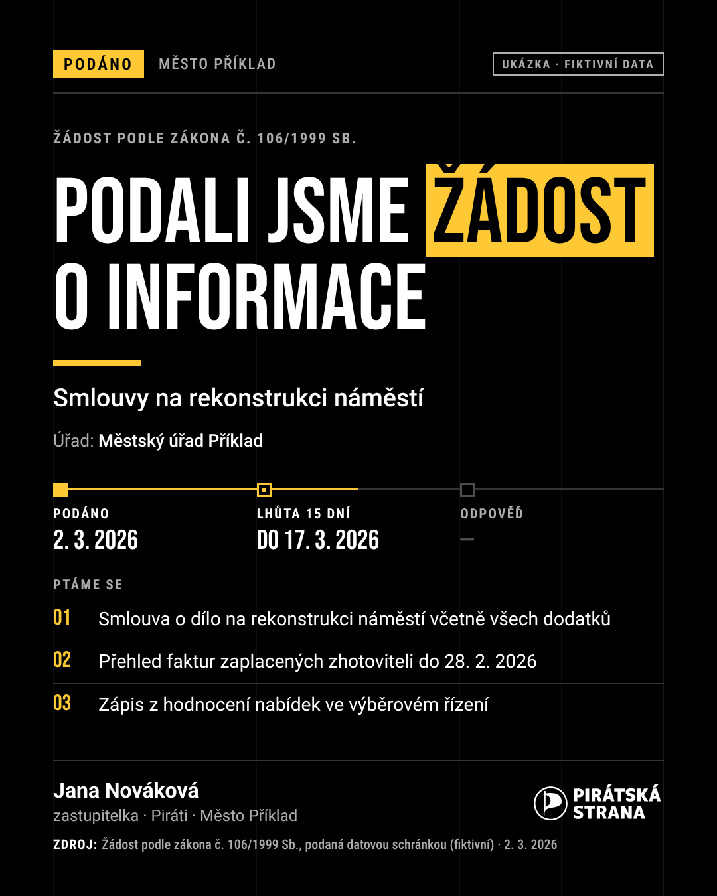
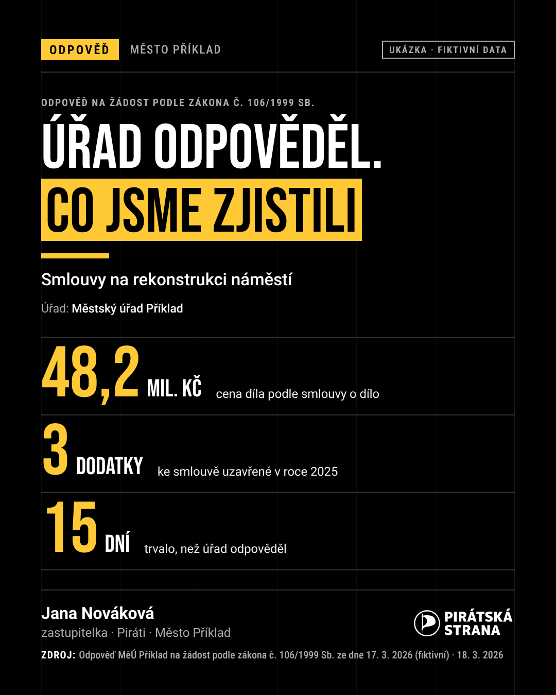
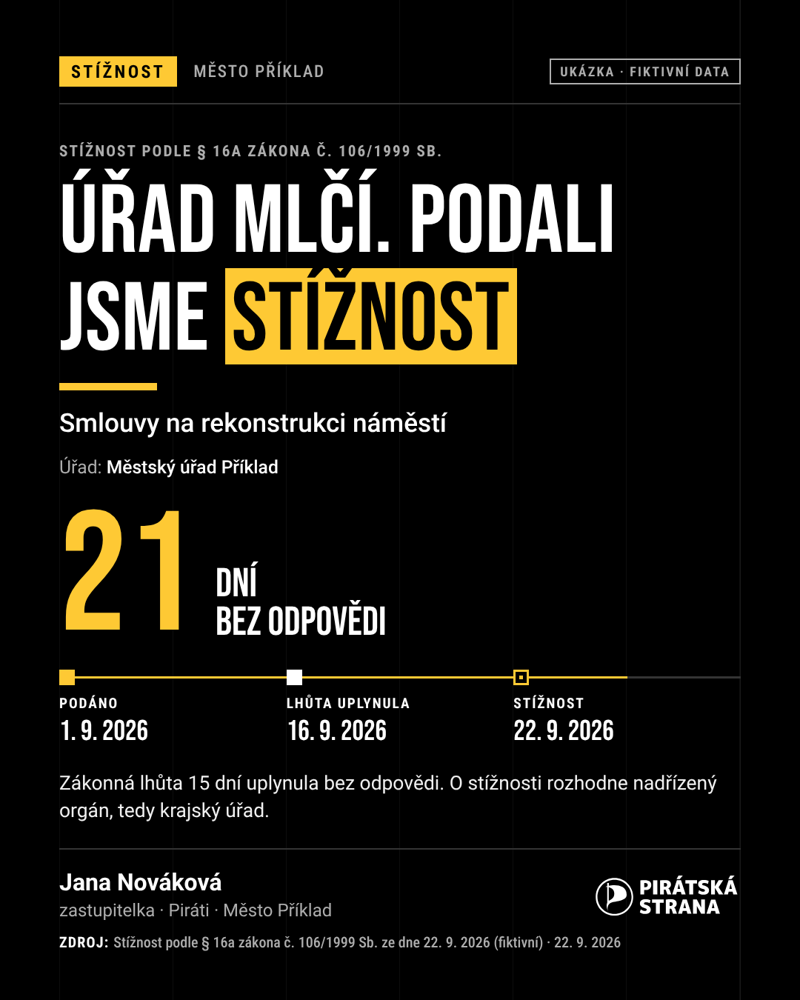
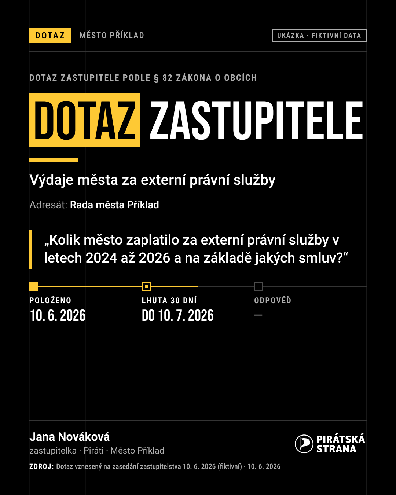

# Ukázky: grafika a animovaná videa k žádostem podle zákona 106

Ukázky na **fiktivních datech** („Město Příklad“, zastupitelka Jana Nováková). Všechno je
vyrenderované ze šablon v repozitáři, bez placených služeb. Postup popisuje
[`docs/video-navod.md`](../video-navod.md).

## Video „co jsme zjistili“


| Formát | Kde použít | Soubor |
|---|---|---|
| 9:16, 1080×1920, 22 s | Reels, TikTok, Stories, Shorts | [namesti-106-9x16.mp4](namesti-106-9x16.mp4) |
| 16:9, 1920×1080, 22 s | YouTube, LinkedIn, web | [namesti-106-16x9.mp4](namesti-106-16x9.mp4) |

Video vzniklo ze scénáře [`templates/video/priklady/namesti-106.json`](../../templates/video/priklady/namesti-106.json):
titulek, velké číslo, citace z odpovědi úřadu, časová osa žádosti a výzva. Titulky jsou
přímo v obraze, protože se videa na sítích většinou přehrávají bez zvuku.

## Karty na sítě (1080×1350)

| Podali jsme žádost | Úřad odpověděl | Úřad mlčí: stížnost | Dotaz zastupitele |
|---|---|---|---|
|  |  |  |  |

Každá karta existuje i ve formátech 1080×1080, 1080×1920 a 1920×1080.

## Jak si udělat vlastní

S připojeným MCP serverem stačí AI napsat, že jste podali žádost nebo že přišla odpověď.
Průvodce `pruvodce_zadosti` nabídne lhůty do kalendáře, text příspěvku a prompty
`video_106` a `grafika_106`, které z podání nebo odpovědi napíšou scénář. Render pak
proběhne lokálně nebo v Claude Code:

```sh
python3 scripts/render_video.py --scenar scenar.json --format 1080x1920 --out video.mp4
python3 scripts/render_grafika.py --sablona odpoved --data karta.json --format vse --out karta.png
```

Kdo nemá Python, může stejné texty použít v Canvě nebo Adobe Express podle návodu.
